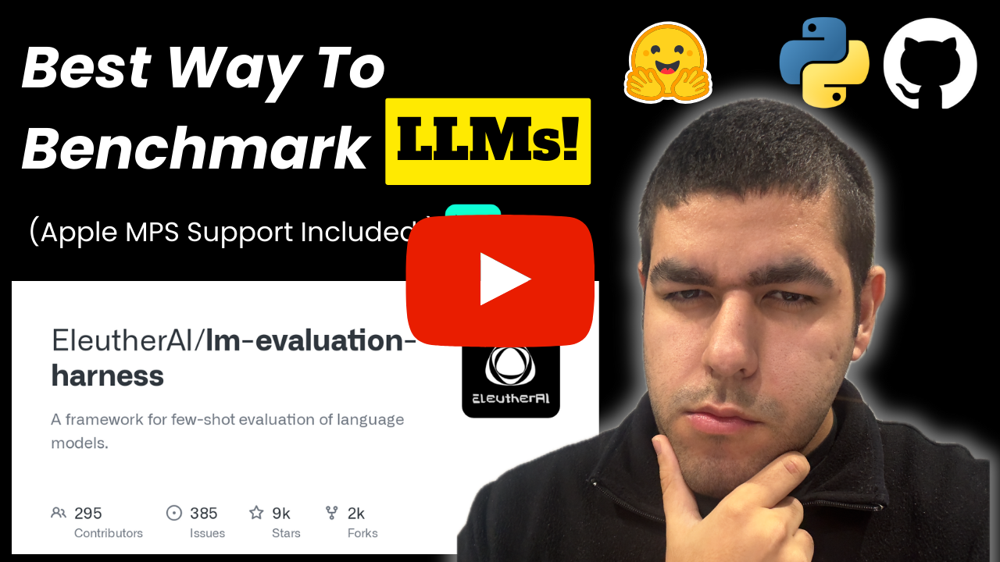

# How to Benchmark LLMs Using LM Evaluation Harness - Multi-GPU, Apple MPS Support

    
    

    

 

    
Liked our work? give us a ⭐!

Want to benchmark your LLMs efficiently? In this video, I'll walk you through setting up the LLM evaluation harness with full support for multi-GPU setups and Apple’s MPS accelerator.

## YouTube Tutorial

    <a href="https://www.youtube.com/watch?v=pd6yL654-3Y">PHow to Benchmark LLMs Using LM Evaluation Harness - Multi-GPU, Apple MPS Support</a>
     
     
    

